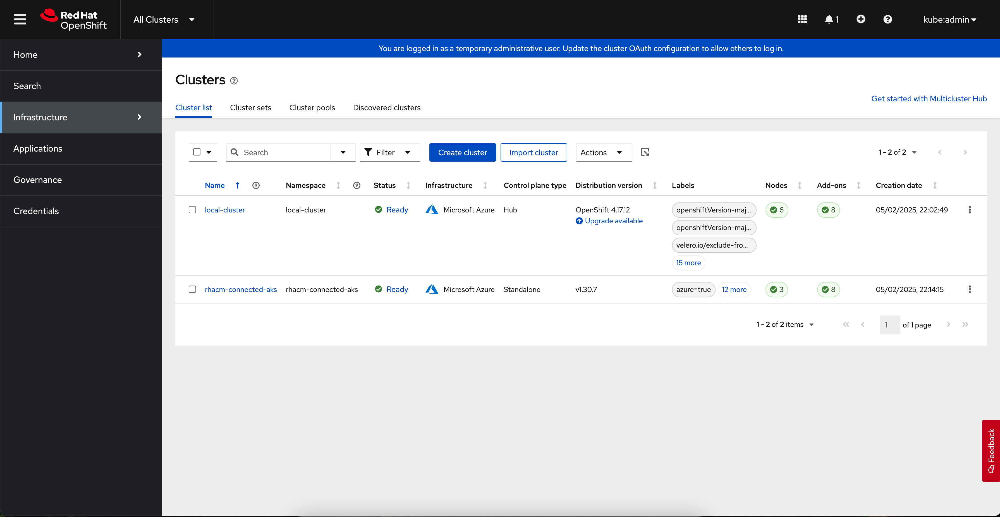
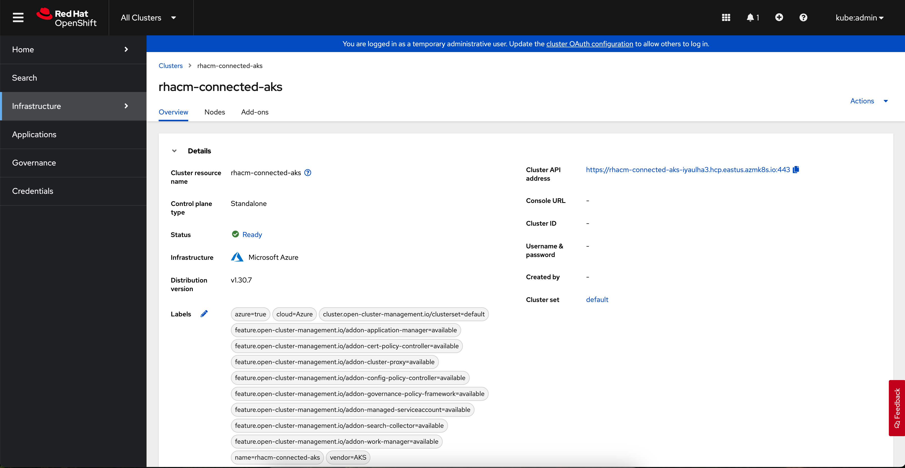
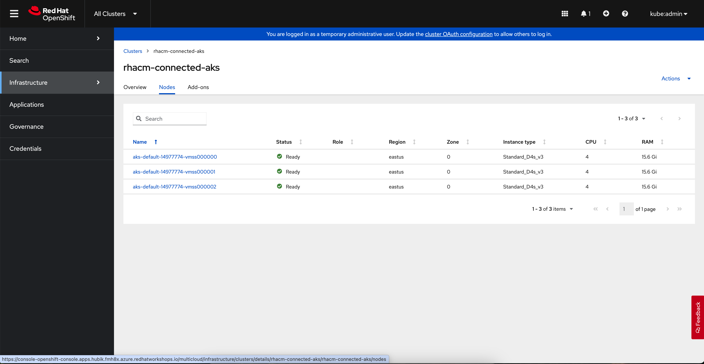
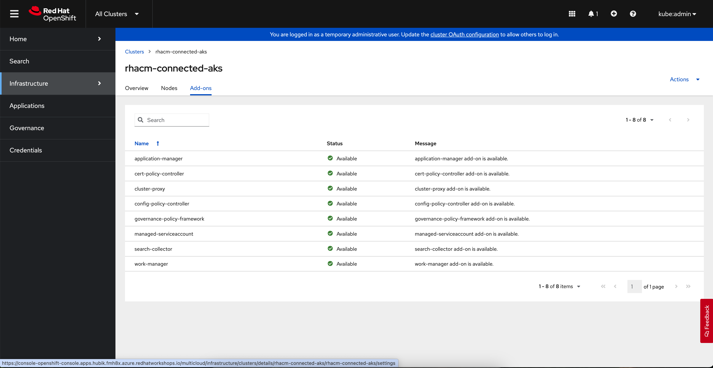
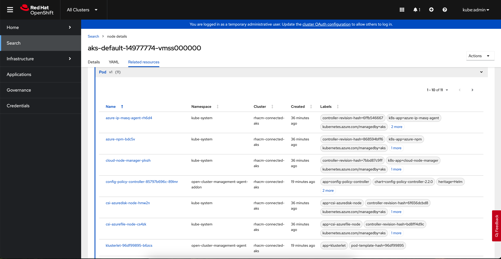

## RHACM setup and integration to manage Azure AKS and other K8S clusters

### Project Overview
Following project provides the instructions to setup and integrate RHACM (Red Hat Advanced Cluster Management for Kubernetes) operator to manage Azure AKS and other K8S clusters.
Managing all kubernetes clusters in one place is a big challenge, RHACM provides the easy and cost effective solution.

Topics covered:
- bastion host setup
- bastion host configuration (installation of required components)
- Red Hat OpenShift default installation at Azure (at the aro directory I provided ARO option)
- RHACM operator installation and setup (see: rhacm_important_notice.txt)
- Azure AKS cluster setup and integration

### Setup Instructions
Setup process could be done from your local machine, or from remote, Azure bastion host we can create with scripts provided in the [bastion](./bastion) directory.

1. Generate SSH key pair:

```
cd bastion
./01_generate_ssh_key.sh
```
2. Create bastion host:

```
terraform init
terraform plan
terraform apply
```

3. Once bastion host is ready for use, get its IP and SSH to it: 

```
ssh -i .ssh/bastion_key azureuser@[YOUR_IP]
```

4. Clone this repository to the bastion host:

```
git clone https://github.com/mmartofe/azure-aks-rhacm.git
```

5. Install required tools at the bastion host:

```
cd azure-aks-rhacm/bastion
./02_install_tools_at_bastion.sh
```

6. Configure sample AKS cluster at your Azure subscription:

```
cd azure-aks-rhacm/aks
terraform init
terraform plan -var="subscription_id=$SUBSCRIPTION"
terraform apply -var="subscription_id=$SUBSCRIPTION"
```
get newly created kubectl configuration:

```
./01_get_aks_credentials.sh
```

7. Install Red Hat OpenShift at your Azure subscription:

```
./04_ocp_install.sh
```
note console access and kubeadmin password once process is done

8. Configure RHACM and integrate AKS cluster according to [rhacm_important_notice.txt](rhacm_important_notice.txt) instructions.

### Project Screenshots

After successful installation of RHACM operator and integration to AKS cluster you should see effects like on the following screenshots:

#### Image 1


#### Image 2


#### Image 3


#### Image 4


#### Image 5


## License

This project is licensed under the Apache License, Version 2.0. See the [LICENSE](LICENSE) file for details.

### Apache License Key Points

- You are free to use, modify, and distribute this software
- Commercial use is permitted
- Modification and distribution require preservation of copyright and license notices
- No warranty is provided
- Contributors provide the software "as is"

For the full license text, please refer to the [LICENSE](LICENSE) file in the project root.